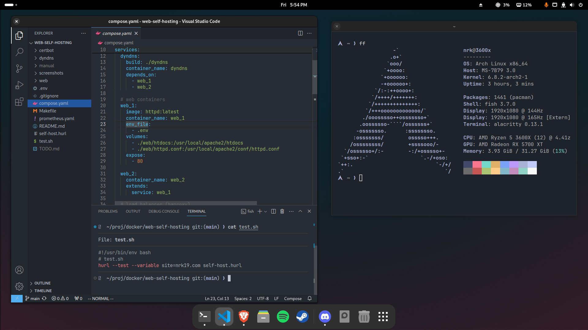
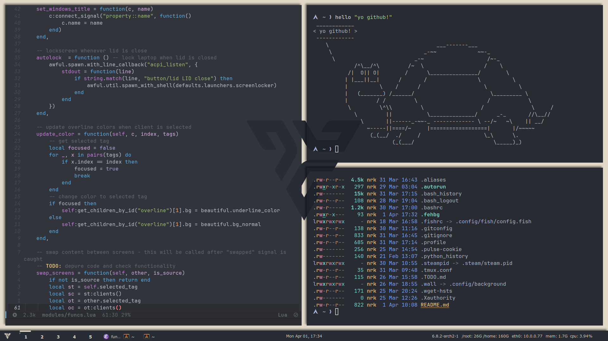

# dotfiles

The main porpouse of this repo is to use it as a backup to my dotfiles, but I made it public just in case someone gets here and find helpful any of the configuration files. Peace!

## main config files

| [awesome](.config/awesome/) | [fish](.config/fish) | [bash](.bashrc) | 
|-----------------------------|----------------------|-------------------|
| [gnome](.config/gnome-settings.conf) | [alacritty](.config/alacritty/alacritty.toml) | [picom](.config/picom/picom.conf) |

## preview

- Gnome: 

- Awesome WM: 

